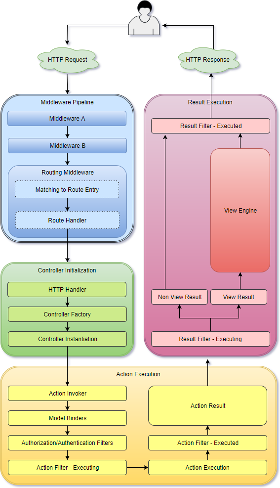

# Версія 1. Структура, архітектура проекту.



[https://github.com/MrComatose/lecture-app](https://github.com/MrComatose/lecture-app) -  код

[http://kovalukapp-001-site1.htempurl.com](http://kovalukapp-001-site1.htempurl.com) - сайт


## Завдання 

Розробити персональний сайт викладача. 

* Авторизація по ролям \(студент, лектор\). 
* Можливість завантажувати та видаляти файли.
* Розробити систему для ведення груп студентів, контролю відвідування лекцій студентом.
* Управління контентом сайт \(новини, акаунти, документація\).
* Система завдань студента, статистика виконання завдання. Успішність студентів.

## Технології

Враховуючи усі критерії розробки, були використані наступні технології.

#### Server-side:

* .Net core sdk [https://dotnet.microsoft.com/download](https://dotnet.microsoft.com/download)
* Asp.Net core MVC framework [https://docs.microsoft.com/en-us/aspnet/core/?view=aspnetcore-2.2](https://docs.microsoft.com/en-us/aspnet/core/?view=aspnetcore-2.2)
* Razor view engine
* MSSql server 
* ORM Entity framework core 2 

#### Client-side:

* Html5
* CSS3
* JS ES2016
* MaterializeCss framework [https://materializecss.com/](https://materializecss.com/)
* jQuery

#### Інструменти розробки:

* IDE Visual Studio 2017, VS Code
* Nuget package manager
* Git
* Hosting service [https://www.smarterasp.net/](https://www.smarterasp.net/)
* MSSql server

## Архітектура проекту

Рішення має клієнт-серверну архітектуру з передачею даних по протоколу HTTP. Для збереження інформації використовується база даних MsSql з ORM Entity Framework core. Для написання серверу використовується мова C\# та технології Asp.Net core. Asp.Net Core MVC - новий потужний фреймворк з відкритим кодом для написання веб-орієнтованих рішень, програми написані на .Net core можна запустити на linux, macOS, Windows.



Як можна побачити на рисунку 1 обробка http запиту проходить в декілька етапів, кожен з яких є гнучким інструментом інфраструктури MVC. Суть роботи фреймворк наступна: запит проходить рівень конвеєра обробки запиту, де можна взаємодіяти з рівнем HTTP  безпосередньо за допомогою компонентів middleware. Один із таких компонентів за маршрутом  знаходить потрібний контролер, створює його та викликає метод, який належить контролеру та повертає відповідь. Всі етапи можна гнучко налаштовувати та переписувати, так як інфраструктура MVC являє собою систему з слабозвязних компонентів. 

## Структура проекту


### 
Main\(\)

Метод Main\(\), який є початковою точкою виконання програми, знаходиться в файлі Program.cs. 

```csharp
 public class Program
    {
        public static void Main(string[] args)
        {
            BuildWebHost(args).Run();
        }

        public static IWebHost BuildWebHost(string[] args) =>
            WebHost.CreateDefaultBuilder(args)
                .UseStartup<Startup>()
                .Build();
}
```

Для побудови та запуску IWebHost використовується конфігураційний клас Startup, в якому реєструються усі компоненти нашого веб рішення. За замовченням клас Startup пустого веб шаблону Asp.Net Core 2.1 у Visual Studio 2017 виглядає наступним чином.

```csharp

    public class Startup
    {
        public void ConfigureServices(IServiceCollection services)
        {
        }
 
        public void Configure(IApplicationBuilder app, IHostingEnvironment env)
        {
            if (env.IsDevelopment())
            {
                app.UseDeveloperExceptionPage();
            }
 
            app.Run(async (context) =>
            {
                await context.Response.WriteAsync("Hello World!");
            });
        }
    }

```

У методі Configure\(\) можна налаштувати роботу middleware а у методі ConfigureServices\(\) відбувається налаштування та реєстрація сервісів які будуть використовуватись під час роботи програми. 

### MVC

Для налаштування роботи MVC за замовченням достатньо додати реєстрацію сервісів \(додаються методом services.AddMvc\(\)\) у методі Startup.ConfigurateServices\(\) та використати їх у методі Services.Configurate\(\) \(app.UseMvcWithDefaultRoute\(\)\). Дана конфігурація забезпечуватиме роботу за замовченням при якій шаблон URL матиме наступний вигляд  `{/controller=Home/action=index/id?=0}.` Тобто для механізм зіставлення запитів буде шукати в URL назву контролера та назву методу цього контролера після чого шукати тип цього контролеру. За замовченням контролери повинні знаходитися у каталозі Controllers. Бізнес логіка відокремлена у каталозі Models. У каталозі Views знаходиться елементи UI, а саме .cshtml розмітка яка являє собо шаблон, html + c\# для генерації класів c\# які генерують html. Для користувацьких ресурсів виділена папка wwwroot в якій будуть зберігатися усі залежності для сторони клєнта. Також для контролю ресурсів сайту для різних типів користувачів код розділений на зони доступу, в саме в корні знаходяться ресурси доступні для всіх користувачів в каталозі Areas знаходяться каталоги з аналогічною структурою до інших зон доступу.

Фінальний код класу Startup:

```csharp
using System;
using Microsoft.AspNetCore.Authentication;
using System.Linq;
using System.Threading.Tasks;
using Microsoft.AspNetCore.Builder;
using Microsoft.AspNetCore.Hosting;
using Microsoft.AspNetCore.Http;
using Microsoft.AspNetCore.Identity;
using Microsoft.EntityFrameworkCore;
using Microsoft.Extensions.Configuration;
using Microsoft.Extensions.DependencyInjection;
using KovalukApp.Models;
using Microsoft.AspNetCore.Mvc.Razor;

namespace KovalukApp
{
    public class Startup
    {
        public Startup(IHostingEnvironment env)
        {
            Configuration = new ConfigurationBuilder()
                .SetBasePath(env.ContentRootPath)
                .AddJsonFile("Config.json")
                .Build();
        }

        public IConfiguration Configuration { get; }
        public void ConfigureServices(IServiceCollection services)
        {
          services.Configure<RazorViewEngineOptions>(opt => { opt.ViewLocationExpanders.Add(new EmailTemplateExpender()); });
            services.AddMvc();
            services.AddDbContext<ApplicationContext>(options =>
                 options.UseSqlServer(Configuration.GetConnectionString("DefaultConnection")));
            services.AddTransient<IUserRepository,UserDataRepository>();
            services.AddTransient<IGroupsRepository, EFGroupRepository>();
            services.AddTransient<IDocStorage, DocPagesRepository>();
            services.AddTransient<IFileStorage, EFFileStorage>();
            services.AddTransient<INewsStorage, NewsRepository>();
            services.AddTransient<AppMailSender>();
            services.AddSingleton<IConfiguration>(Configuration);
            services.AddScoped<RazorViewToStringRenderer>();
            services.AddIdentity<User, IdentityRole>()
                  .AddDefaultTokenProviders()
                .AddEntityFrameworkStores<ApplicationContext>();
            services.ConfigureApplicationCookie(options =>
            {
                options.LoginPath = "/Account/Login";
                options.ReturnUrlParameter = "returnUrl";
                options.LogoutPath = "/Account/LogOut";
                options.AccessDeniedPath = "/";
              
               
            });
            services.Configure<IdentityOptions>(options =>
            {
                // Password settings
                options.Password.RequireDigit = true;
                options.Password.RequiredLength = 8;
                options.Password.RequireNonAlphanumeric = false;
                options.Password.RequireUppercase = false;
                options.Password.RequireLowercase = false;
                options.Password.RequiredUniqueChars = 6;
                
                // Lockout settings
                options.Lockout.DefaultLockoutTimeSpan = TimeSpan.FromMinutes(30);
                options.Lockout.MaxFailedAccessAttempts = 10;
                options.Lockout.AllowedForNewUsers = true;
                
                options.User.AllowedUserNameCharacters += "йцукенгшщзхїєждлорпавіфячсмитьбю" + "йцукенгшщзхїєждлорпавіфячсмитьбю".ToUpper();
                // User settings
                options.User.RequireUniqueEmail = true;
            
            });

           
        }

        // This method gets called by the runtime. Use this method to configure the HTTP request pipeline.
        public void Configure(IApplicationBuilder app, IHostingEnvironment env,IServiceProvider service)
        {
            if (env.IsDevelopment())
            {
                app.UseDeveloperExceptionPage();
                app.UseBrowserLink();
            }
            app.UseStaticFiles();
            app.UseAuthentication();
           
            app.UseMvc(routes =>
            {
                routes.MapRoute(
                  name: "areas",
                  template: "{area:exists}/{controller=Home}/{action=Index}/{id?}"
                );
            
                routes.MapRoute(
                    name:"default",
                    template:"{controller}/{action}/{id}",
                    defaults: new {controller="Home",action="Main",id=0 }
                    );
               
            });
            UserManager<User> appManager = service.GetService<UserManager<User>>();
            RoleManager<IdentityRole> appRoles = service.GetService<RoleManager<IdentityRole>>();
            ApplicationContext.CreateTeacherAccount(appManager,appRoles,Configuration).Wait();
        }
    }
}
```

### Config.json

Конфігурація роботи з базою даних, створення першого акаунту, даних smtp для роботи повідомлень на електронну скриньку, знаходяться у файлі Config.json. Всі ці данні необхідні для розгортання, та роботи сайту.

```javascript
{

  "Data": {
    "EmailSettings": {
      "SmtpServer": "smtp.gmail.com",
      "Login": "kovalukapp@gmail.com",
        "Password": "secret123"
    },
    "Admin": {
      "FirstName": "FirstName",
      "LastName": "LastName",
      "Email": "kovalukapp@gmail.com",
      "Password": "secret123",
      "Username": "Teacher",
      "PhoneNumber": "0672222713",
      "Roles": "Teacher"
    }
  },

  "ConnectionStrings": {
    //"DefaultConnection": "Server=(localdb)\\MSSQLLocalDB;Database=KovalukAppDataBase;Trusted_Connection=True;MultipleActiveResultSets=true",
    "DefaultConnection": "Data Source=SQL6006.site4now.net;Initial Catalog=DB_A42A23_KovalukApp;User Id=DB_A42A23_KovalukApp_admin;Password=;"
  }
}
```

## Підсумок

В першій версії було вирішено ряд архітектурних питань, створене  рішення  для подальшого впровадження бізнес логіки та налаштована гнучка інфраструктура MVC. Все це надає можливість побудувати веб-орієнтоване рішення, яке легко розширюється та тестуватиметься.

