# Версія 4. Користувацька документація. Вчитель.

## Головна сторінка

Головна сторінка - це landing page з інформацією про акаунт вчителя, новинами та кнопкою авторизації. 


Інформація акаунту виводиться наступним чином:

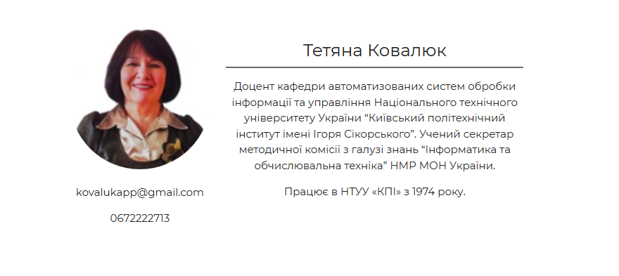

Новини:

Для роботи з веб-додатком необхідно авторизуватися. Для цього необхідно натиснути на посилання  Log in у верхньому лівому куту головної сторінки, або на кнопку sign in першої секції лендінгу.

### Форма авторизації


Для входу необхідно ввести електронну пошту та пароль. Для того щоб автоматично оновлювати кукі необхідно натиснути на чекбокс Remember me. У разі ситуації коли користувач не може ввести пароль існує функція поновлення паролю посилання Forgot password?.

## Меню вчителя

Після входу в систему на місці посилань на сторінку авторизації розміщується кнопка с ім'ям акаунту, яка відкриває меню.

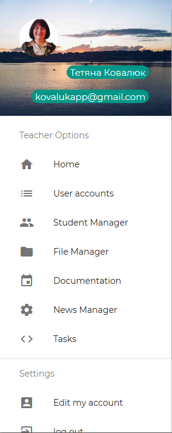

* Home - Головна сторінка
* User accounts - сторінка з інформацією про всі зареєстровані акаунти в системі
* Student Manager - сторінка управління групами студентів
* File Manager - сторінка управління файлами в системі
* Documentation - Сторінка управлінням інформаційними ресурсами
* News Manager - Управління новинами
* Tasks - сторінка управління завданнями студентів
* Edit my account - сторінка редагування поточного акаунту
* Log out - вихід з системи

## User accounts

На цій сторінці виводиться інформація про акаунти зареєстровані в системі, вибіркою по 5 штук з посторінковим виводом. Також на сторінці є поле для пошуку акаунту.


Біля кожного акаунту є кнопка з іконкою edit для переходу на сторінку редагування конкретного акаунту. Також при натисканні на текстову інформацію акаунту відкриється сторінка з більш детальною інформацією.

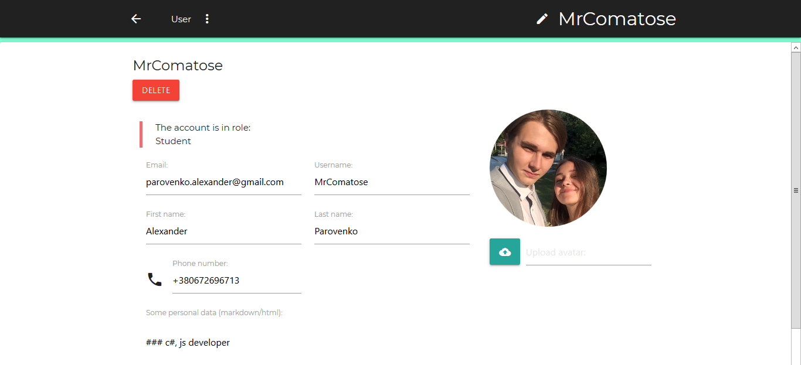

## Student Manager

Ця сторінка відображає список всіх групп зареєстрованих у системі. У картці кожної групи є кнопка для видалення та кнопка select для управління конкретною групою.

Також на цій сторінці є кнопка для створення нової групи.

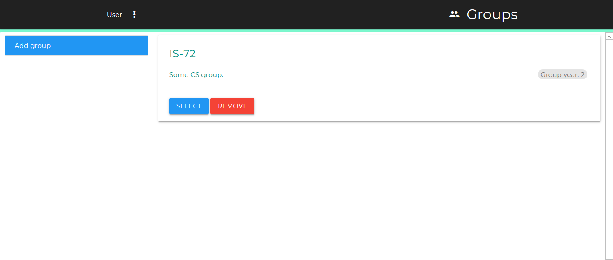

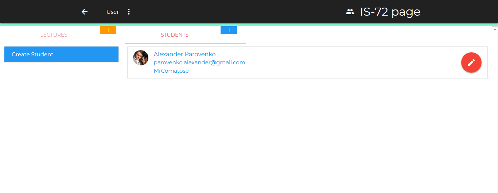


На сторінці групи можна знайти інформацію про студентів та кнопку для створення акаунту студента, інформацію про лекції з можливістю редагування та кнопку для створення нової лекції.

При натисканні на студента відкриється сторінка с профілем студента.

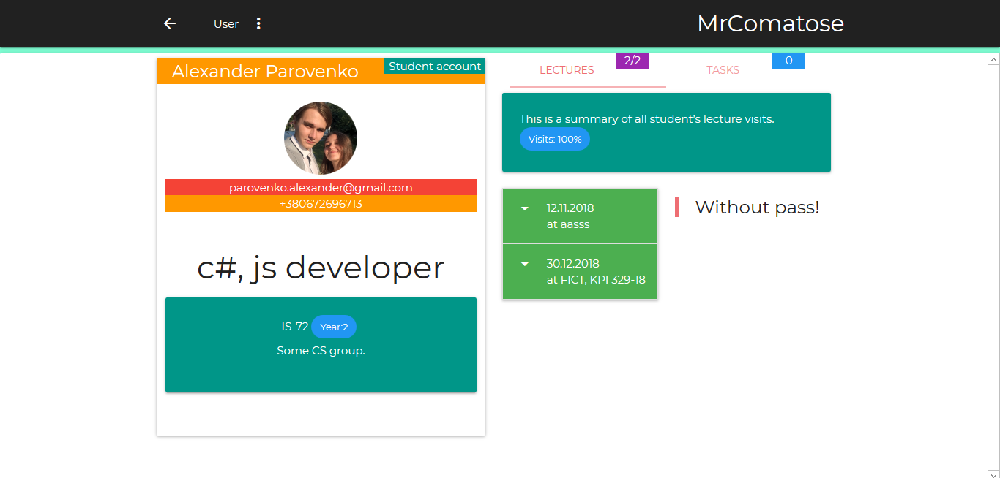

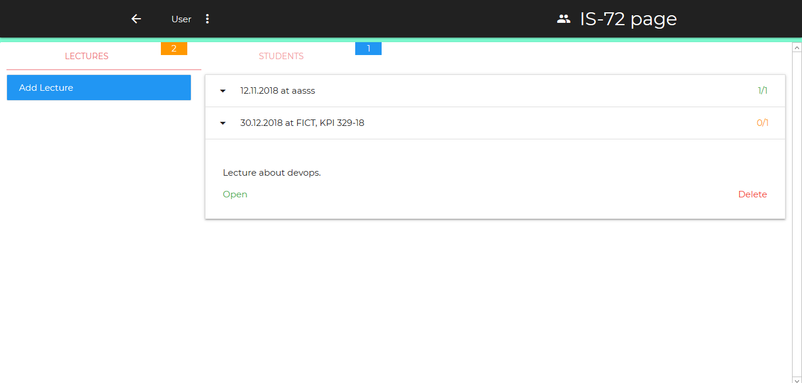

Біля кожної лекції знаходиться відношення студентів які відвідали лекцію до всіх студентів. При натисканні на лекцію випадає текстова інформація про лекцію та 2 кнопки для видалення та відкриття списку відівідуваності.

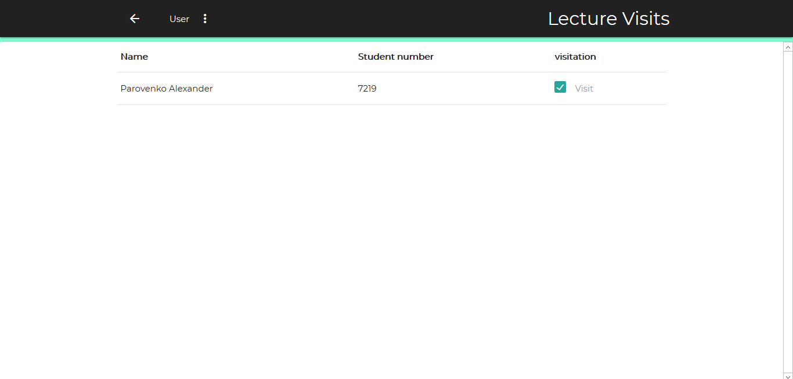

## 
File Manager

На цій сторінці відображається інформація про всі файли які були завантажені в систему з можливістю видалення їх, завантаження та скачування. Для скачування файлу необхідно натиснути на його іконку або текст.

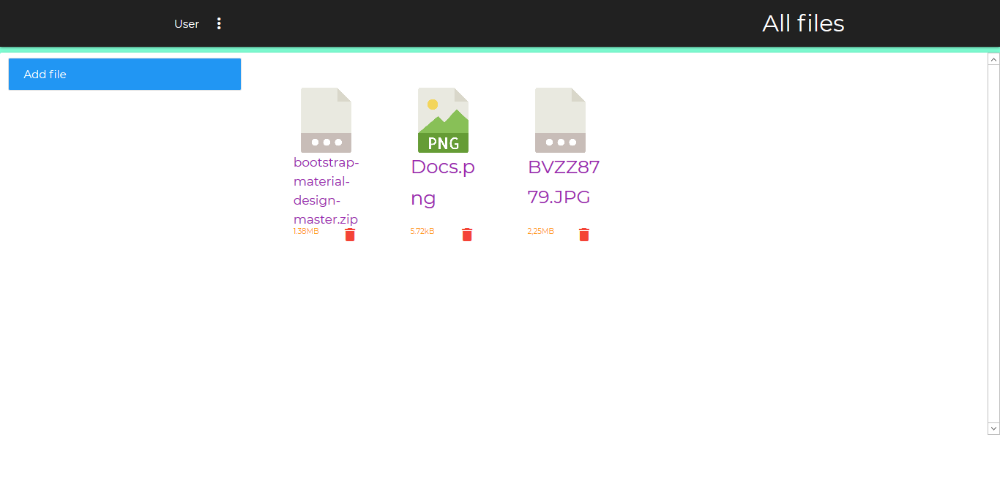

## Documentation

Документація - це контент який створює вчитель для студентів різних груп, або для всіх студентів. На сторінці виводиться список документації, кнопки створення сторінок\( для якоїсь групи або публічну\). У кожної картки сторінки документації є кнопки видалення та вибору.

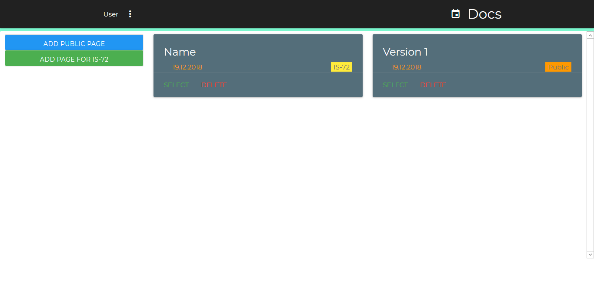


При виборі сторінки ми переходимо до редагування документації. До кожнох сторінки можна додати файли з поясненням, текстову інформацію у форматі html або Markdown. Для сторінок які належать групі студентів можна додавати завдання студента, яке будуть відображатися на сторінці студентам доки його не вибере окремий студент. Також можна додати однакове завдання всім учасникам групи.

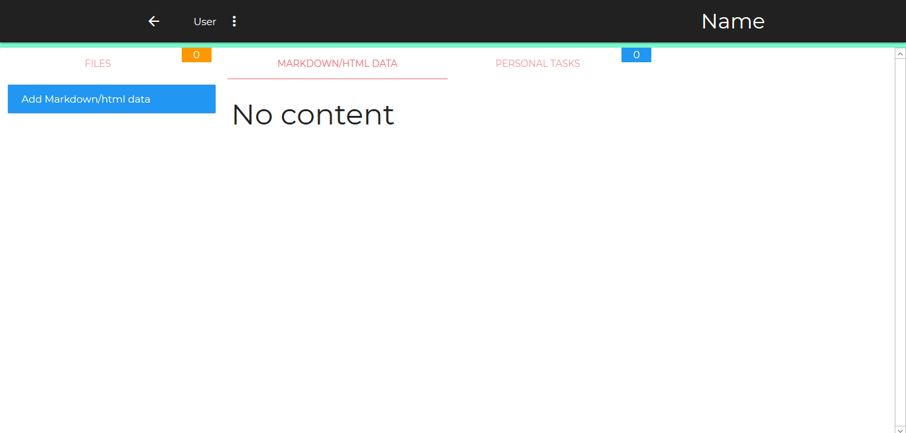

## News manager

На сторінці управління новинами можна створювати видаляти та переглядати всі новини які знаходяться в базі.

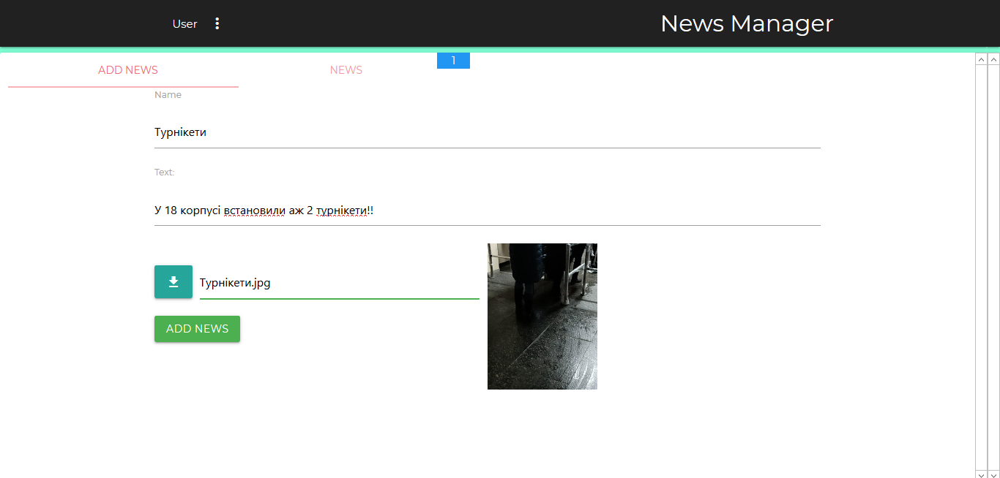

## Tasks

Управління завданнями на момент написання звіту не допрацьоване. На цей момент на цій сторінці можна побачити всі завдання та неперевірені завдання. Кількість неперевірених завдань буде підсвічена прямо в меню вчителя біля напису Tasks.

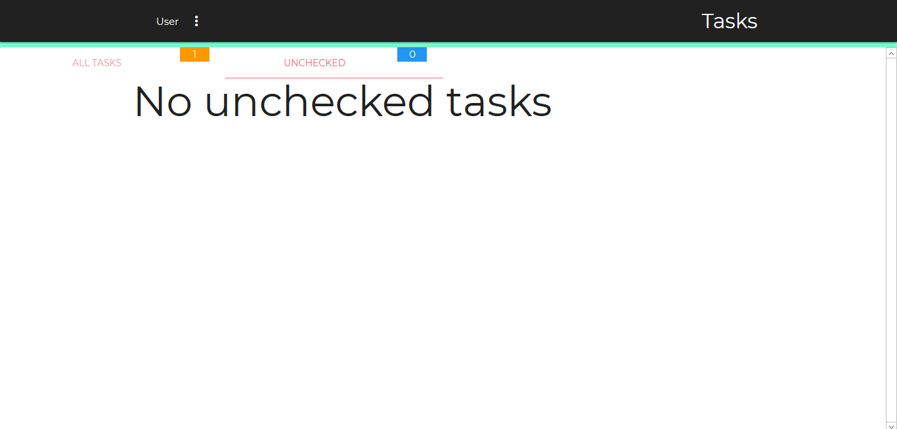

## Підсумок

У користувацькому звіті для вчителя було огланено графічний інтерфейсь веб-додатку з боку користувача з ролью вчитель. 

