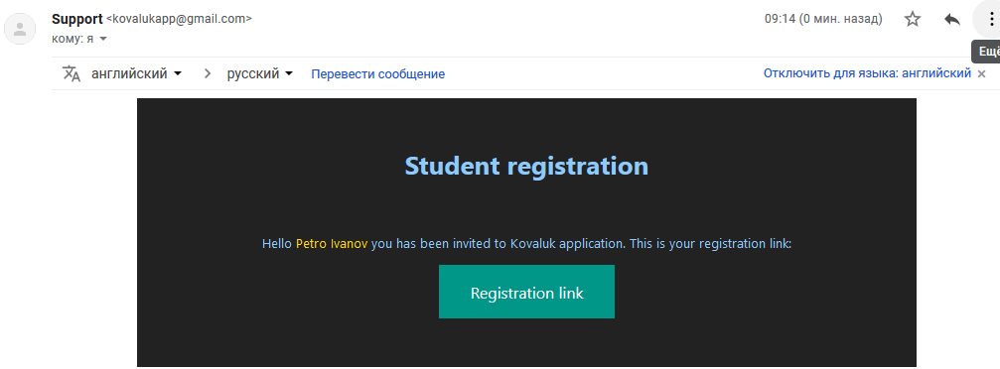
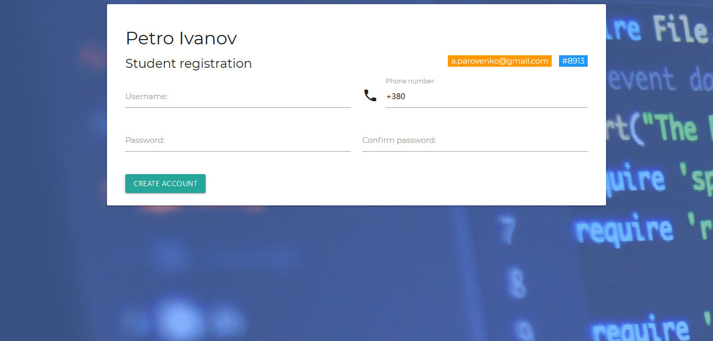
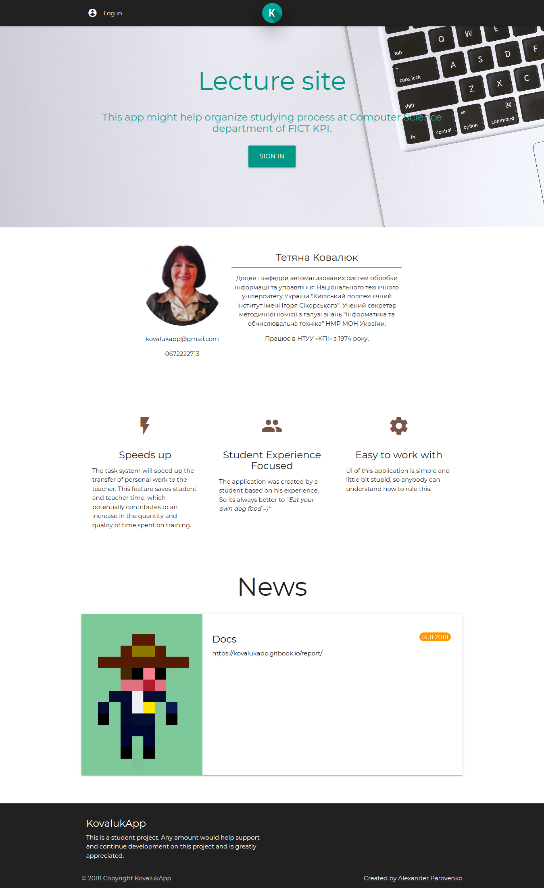
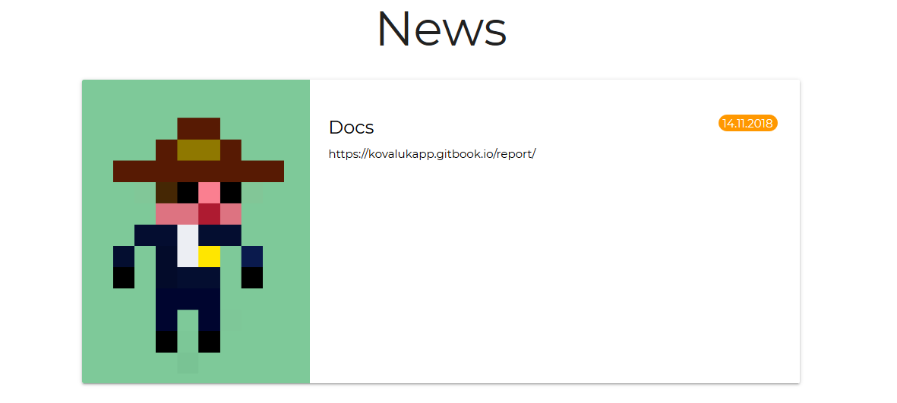
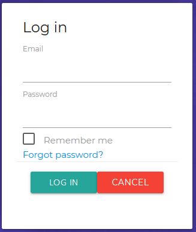

# Версія 5. Користувацька документація. Студент.

## Лист з запрошенням

Після того як вчитель створює акаунт студента, на зазначену пошту приходить лист з посиланням на реєстрацію. За цим посиланням знаходиться форма реєстрації.

## Головна сторінка

Головна сторінка - це landing page з інформацією про акаунт вчителя, новинами та кнопкою авторизації. 


Інформація акаунту виводиться наступним чином:


Новини:

Для роботи з веб-додатком необхідно авторизуватися. Для цього необхідно натиснути на посилання  Log in у верхньому лівому куту головної сторінки, або на кнопку sign in першої секції лендінгу.

### Форма авторизації

Для входу необхідно ввести електронну пошту та пароль. Для того щоб автоматично оновлювати кукі необхідно натиснути на чекбокс Remember me. У разі ситуації коли користувач не може ввести пароль існує функція поновлення паролю посилання Forgot password?.

## Меню студента

Після входу в систему на місці посилань на сторінку авторизації розміщується кнопка с ім'ям акаунту, яка відкриває меню.

