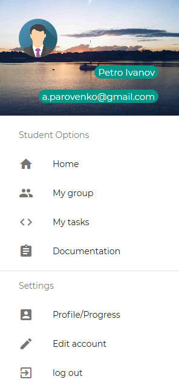
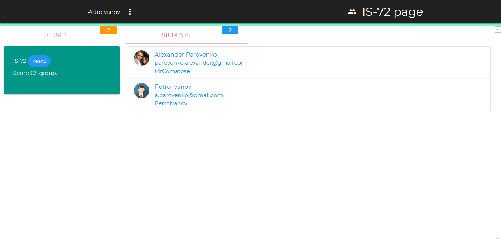
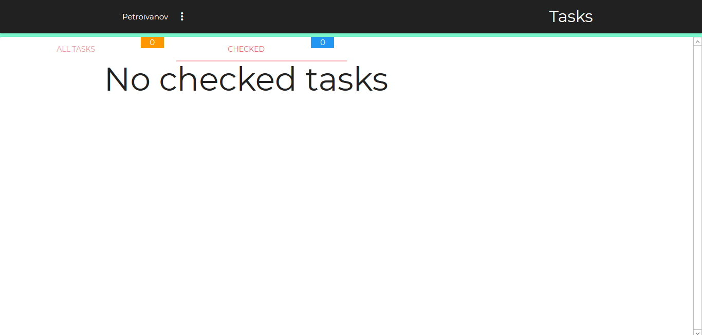
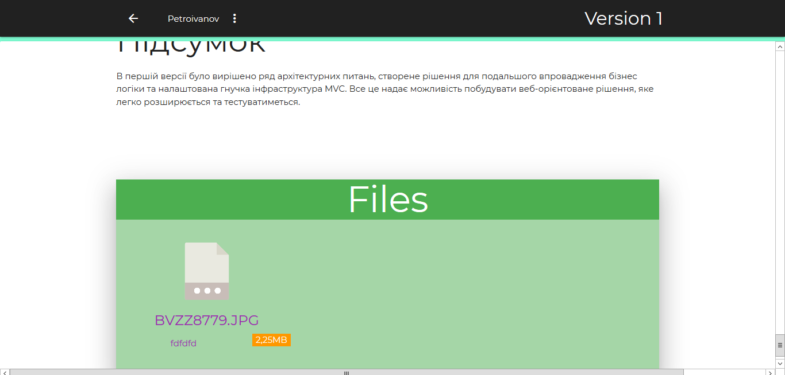
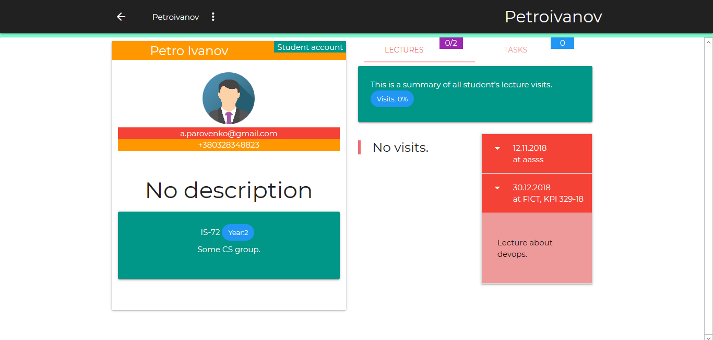

# Версія 5. Користувацька документація. Студент.

## Лист з запрошенням

Після того як вчитель створює акаунт студента, на зазначену пошту приходить лист з посиланням на реєстрацію. За цим посиланням знаходиться форма реєстрації.

## Головна сторінка

Головна сторінка - це landing page з інформацією про акаунт вчителя, новинами та кнопкою авторизації. 


Інформація акаунту виводиться наступним чином:


Новини:

Для роботи з веб-додатком необхідно авторизуватися. Для цього необхідно натиснути на посилання  Log in у верхньому лівому куту головної сторінки, або на кнопку sign in першої секції лендінгу.

### Форма авторизації

Для входу необхідно ввести електронну пошту та пароль. Для того щоб автоматично оновлювати кукі необхідно натиснути на чекбокс Remember me. У разі ситуації коли користувач не може ввести пароль існує функція поновлення паролю посилання Forgot password?.

## Меню студента

Після входу в систему на місці посилань на сторінку авторизації розміщується кнопка с ім'ям акаунту, яка відкриває меню.

* Home - головна сторінка
* My group - сторінка з інформацією про учасників групи та лекцій
* My tasks - сторінка з персональними задачами 
* Documentation - Сторінки контенту для студента
* Profile/Progress - профіль студента 
* Edit account - редагувати акаунт
* log out - вийти

## My group 

На цій сторінці відображається інформація про лекції групи та учасників групи\(інших студентів\).

## My tasks

Відображаються всі задачі та окремо перевірені задачі викладачем. До окремої задачі можна додати файли та текстове повідомлення після чого задача помічається як не перевірена.

## Documentation 

В документації знаходяться сторінки з контентом який створює викладач для окремих груп або для всіх студентів. На сторінці документації можуть знаходитися файли та задачі, які можна завантажити та обрати для виконання відповідно.

## 
Profile/Progress

На поточній сторінці студент може переглянути свій профіль, оцінки, лекції на яких його відмітили. Інформація профілю конкретного студента доступна лише цьому студенту та вчителю.

## Підсумок

У користувацькому звіті для студента було оглянено графічний інтерфейс веб-додатку з боку користувача з роллю студент. 

