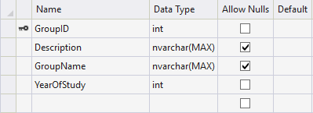

# Версія 2. Структура даних.

## База даних

Для збереження даних на сервері використовується база даних MsSql у поєднанні з ORM Entity Framework Core 2. Так як наш код взаємодіє лише з EF базу даних можна легко замінити на будь яку SQL базу даних яка підтримується EF Core. 

#### Маємо наступні таблиці



Таблиці з префіксом Asp.Net були згенеровані системою авторизації і про них йдеться в 3 версії.


#### Загалом маємо 8 таблиць, а саме:

* Групи студентів



* Лекції


* Відвідування


* Сторінки документацій


* Завдання документацій


* Файли


* Новини


* Додатки до завдань


## Клас контексту бази даних

```csharp
using Microsoft.AspNetCore.Identity;
using Microsoft.AspNetCore.Identity.EntityFrameworkCore;
using Microsoft.EntityFrameworkCore;
using Microsoft.Extensions.Configuration;
using Microsoft.Extensions.DependencyInjection;
using System;
using System.Collections.Generic;
using System.Diagnostics;
using System.Linq;
using System.Threading.Tasks;

namespace KovalukApp.Models
{
    public class ApplicationContext : IdentityDbContext<User>
    {
        public ApplicationContext(DbContextOptions<ApplicationContext> options)
            : base(options)
        {
            Database.EnsureCreated();
        }
        public static async Task CreateTeacherAccount(UserManager<User> appManager,RoleManager<IdentityRole> appRoles, IConfiguration config)
        {
           
            string FirstName = config["Data:Admin:FirstName"];
            string LastName = config["Data:Admin:LastName"];
            string UserName = config["Data:Admin:Username"];
            string Email = config["Data:Admin:Email"];
            string Password = config["Data:Admin:Password"];
            string PhoneNumber = config["Data:Admin:PhoneNumber"];
            string Roles = config["Data:Admin:Roles"];

            var result = await appManager.FindByEmailAsync(Email);
            if (result==null)
            {
                if (await appRoles.FindByNameAsync("Student")==null)
                {
                    await appRoles.CreateAsync(new IdentityRole("Student"));
                }
                if (await appRoles.FindByNameAsync("Admin") == null)
                {
                    await appRoles.CreateAsync(new IdentityRole("Admin"));
                }
                if (await appRoles.FindByNameAsync("Teacher") == null)
                {
                    await appRoles.CreateAsync(new IdentityRole("Teacher"));
                }
                var teacher = new TeacherUser()
                {
                    Email=Email,
                    FirstName=FirstName,
                    LastName=LastName,
                    PhoneNumber=PhoneNumber,
                    UserName=UserName

                };
                
                await appManager.CreateAsync(teacher,Password);
                await appManager.AddToRoleAsync(teacher,Roles);
            }

        }
        public DbSet<TeacherUser> Teachers { get; set; }

       public DbSet<AppFile> Files { get; set; }

        public DbSet<DocFile> DocFiles { get; set; }

        public DbSet<Answer> Answers { get; set; }

        public DbSet<TaskFile> TaskFiles { get; set; }

        public DbSet<StTask> Tasks { get; set; }

        public DbSet<DocPage> Documentation { get; set; }

        public DbSet<Group> Groups { get; set; }

        public DbSet<Lecture> Lectures { get; set; }

        public DbSet<Visit> Visits { get; set; }

        public DbSet<News> News { get; set; }

        public DbSet<StudentUser> Students { get; set; }
    }
}

```

Даний клас забезпечує створення бази даних та доступ до таблиць бази даних. Також в цьому класі реалізовано статичний метод CreateTeacherAccount, який приймає сервіс Config.json, RolesManager та UserManager та заповнює базу даних початковими даними якщо їх там немає.

Для роботи з ApplicationContext нам потрібно зареєструвати його глобально у класі Startup, маємо:

```csharp
services.AddDbContext<ApplicationContext>(options =>
                 options.UseSqlServer(Configuration.GetConnectionString("DefaultConnection")));
```

також потрібно додати поле з об'єктом конфігурації та додати його глобально через контейнер залежностей.

```csharp
  public Startup(IHostingEnvironment env)
        {
            Configuration = new ConfigurationBuilder()
                .SetBasePath(env.ContentRootPath)
                .AddJsonFile("Config.json")
                .Build();
        }

        public IConfiguration Configuration { get; }
```

```csharp
  services.AddSingleton<IConfiguration>(Configuration);
```

## Патерн Repository

Всюди в програмі використовується обгортка для ApplicationContext яка дозволяє поєднати логіку з даними не зважаючи на їх реалізацію. Тобто ми будемо працювати з даними як зі звичайними колекціями об'єктів.

#### Приклад:

Реалізуємо патерн сховища для файлів, які зберігаються у таблиці Files.

Спочатку реалізуємо інтерфейс з яким буде взаємодіяти логіка обробки запитів.

```csharp
public interface IFileStorage
    {
        IQueryable<AppFile> AllFiles { get;  }

        IQueryable<TaskFile> StudentTaskFiles { get;  }

        IQueryable<DocFile> DocumentationFiles { get; }

        void AddTaskFile(TaskFile file);
        void AddDocFile(DocFile file);
        void AddFile(AppFile file);

        void RemoveFile(AppFile file);

        void UpdateFile(AppFile file);

    }
```

Далі зробимо реалізацію цього інтерфейсу за допомогою класу ApplicationContext який наслідує контекст EF core.

```csharp
 public class EFFileStorage : IFileStorage
    {
        ApplicationContext context;
        public EFFileStorage(ApplicationContext db)
        {
            context = db;
        }

        public IQueryable<AppFile> AllFiles => context.Files;

        public IQueryable<TaskFile> StudentTaskFiles => context.TaskFiles;

        public IQueryable<DocFile> DocumentationFiles => context.DocFiles;

        public void AddDocFile(DocFile file)
        {

            context.Add(file);
            context.SaveChanges();
        }

        public void AddFile(AppFile file)
        {
            context.Add(file);
            context.SaveChanges();
        }

        public void AddTaskFile(TaskFile file)
        {
            context.Add(file);
            context.SaveChanges();
        }

        public void RemoveFile(AppFile file)
        {
            context.Remove(file);
            context.SaveChanges();
        }

        public void UpdateFile(AppFile file)
        {
            if (file.AppFileID==0)
            {
                context.Add(file);
            }
            context.SaveChanges();
        }
    }
    
```

ApplicationContext передається у вигляді параметру конструктора. Всі поля та методи EFFileStorage інкапсулюють в собі контекст бази даних. 

Для того щоб використовувати IFileStorage всюди у веб додатку, зареєструємо його у контейнері залежностей, що надасть змогу інфраструктурі MVC керувати життєвим циклом об'єктів. Більш детально про Dependency injection у [https://docs.microsoft.com/en-us/aspnet/core/fundamentals/dependency-injection?view=aspnetcore-2.2](https://docs.microsoft.com/en-us/aspnet/core/fundamentals/dependency-injection?view=aspnetcore-2.2). 

Додамо у метод ConfigureServices класу Startup наступний код.

```text
services.AddTransient<IFileStorage, EFFileStorage>();
```

Метод AddTransient вказує механізму залежностей, що кожен раз коли для створення об'єкта треба реалізація інтерфейсу IFileStorage треба використовувати новий об'єкт EFFileStorage, який в свою чергу потребує об'єкт ApplicationContext зареєстрований раніше.

## Підсумок 

Для збереження даних використовується база даних MsSql. Для взаємодії з базою ORM Entity Framework Core 2.\*. Створено клас контексту бази даних для роботи з базою. Робота з базою даних та EF core інкапсульована у реалізаціях інтерфейсів патерну Repository. Надалі у проекті використовується переважно рівень абстракції реалізації шаблону Repository.

