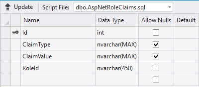
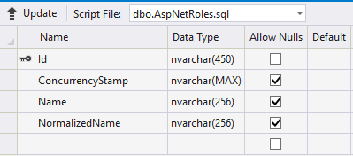
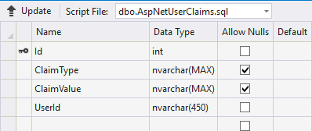
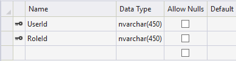
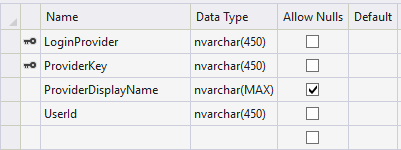
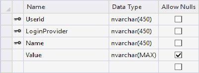
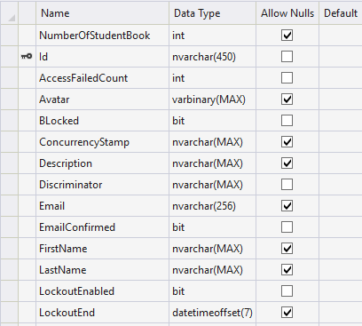
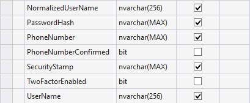

# Версія 3. Авторизація та аутентифікація.

## Авторизація 

Авторизація - процес керування рівнями розподілення ресурсів додатку серед користувачів. В нашому випадку механізм авторизації реалізована за допомогою вбудованого в Asp.Net core  сервісу. ASP.NET Core має вбудовану підтримку аутентифікації на основі куки. Для цього в ASP.NET визначений спеціальний компонент middleware, який серіалізує дані користувача в зашифровані аутентифікаційні куки і передає їх на сторону клієнта. При отриманні запиту від клієнта, в якому містяться аутентифікаційні куки, відбувається їх валідація, десеріалізацію і ініціалізація властивості User об'єкта HttpContext. Для впровадження авторизації згідно з нашою бізнес логікою ствиремо наступні класи:

```csharp
  public class User : IdentityUser ,IUser
         {
        
            public string Description { get; set; }

            public byte[] Avatar { get; set; }

            public bool BLocked { get; set; }

            public string FirstName { get; set; }
        
            public string LastName { get; set; }
        }
```



Де IdentityUser - клас який містить реалізацію основних механізмів авторизації. А IUser - наступний інтерфейс.

```csharp
 public interface IUser
    {
        byte[] Avatar { get; set; }
        string Email { get; set; }
        string FirstName { get; set; }
        string LastName { get; set; }
        string UserName { get; set; }
        string Description { get; set; }
        string PhoneNumber { get; set; }
        string Id { get; set; }
    
    }
```

Також створимо класи:

```csharp
public class StudentUser:User
    {
       public int NumberOfStudentBook { get; set; }
        public int GroupID { get; set; }
    }
```

```csharp
 public class TeacherUser:User
    {
    }
```

Щоб відокремити статичні дані у жорстко закодований спосіб. Для всіх інших персональних даних користувачів можна буде використовувати Chaims.  


## База даних

Як можна побачити у звіті [Версія 2](versiya-2.-struktura-danikh..md) клас ApplicationContext розширено пращуром `IdentityDbContext<User>`  Та додані DbSet&lt;&gt;'и з нашими класами. Після оновлення бази даних EF Core згенерує наступні таблиці.

### AspNetRoleClaims



Об'єкти RoleClaims являють собою інформацію яка прив'язується до певної ролі, наприклад інформація "навчається в КПІ" до користувачів з роллю студента.

### AspNetRoles



Roles - ролі які представлені в нашому додатку.

### AspNetUserClaims



Об'єкти UserClaims аналогічно з RoleClaims прив'язуються до конткретного користувача наприклад вік, стаж, колір очей, кредитна історія та інше.

### AspNetCoreUserRoles



Зв'язок ролі та користувача.

### AspNetCoreLoggins



Збереження інформації про аутентифікації користувача.

### AspNetCoreUserTokens



Збереження згенерованих токенів користувачів.

### AspNetCoreUser





І нарешті самі дані користувача. 

Для реєстрації контексту авторизації необхідно додати наступний код у клас Startup.

```csharp
services.AddIdentity<User, IdentityRole>()
                  .AddDefaultTokenProviders()
                .AddEntityFrameworkStores<ApplicationContext>();
```

## Конфігурація Identity 

Для налаштування валідації даних додамо наступний сервіс.

```csharp
services.Configure<IdentityOptions>(options =>
            {
                // Password settings
                options.Password.RequireDigit = true;
                options.Password.RequiredLength = 8;
                options.Password.RequireNonAlphanumeric = false;
                options.Password.RequireUppercase = false;
                options.Password.RequireLowercase = false;
                options.Password.RequiredUniqueChars = 6;
                
                // Lockout settings
                options.Lockout.DefaultLockoutTimeSpan = TimeSpan.FromMinutes(30);
                options.Lockout.MaxFailedAccessAttempts = 10;
                options.Lockout.AllowedForNewUsers = true;
                
                options.User.AllowedUserNameCharacters += "йцукенгшщзхїєждлорпавіфячсмитьбю" + "йцукенгшщзхїєждлорпавіфячсмитьбю".ToUpper();
                // User settings
                options.User.RequireUniqueEmail = true;
            
            });
```

Даний код реєструє сервіс для налаштування інфраструктури авторизації. Для більш детального налаштування можна реалізувати власні компоненти авторизації\( перевірку пароля, хешування\) та в нашому випадку вистачить звичайного налаштування за допомогою методу Configure&lt;IdentityOptions&gt;.

## Аутентифікація

Для аутентифікації користувача необхідно додати компонент middleware який буде ініціалізувати користувача через зашифровані куки у HTTP. Робиться це наступним чином.

```csharp
  app.UseAuthentication();
```

Даний метод дозволяє нам як розробникам використовувати фільтри аутентифікації при генерації відповіді. Наприклад:

```csharp
  [Authorize]
        public async Task<IActionResult> Profile(string returnUrl,string username)
        {
            var user = await Manager.FindByNameAsync(username);
            var roles =await Manager.GetRolesAsync(user);
            var sanitizer = new HtmlSanitizer();
            var model = new ProfileViewModel()
            {
                UserData=user,
                returnUrl=returnUrl,
                Roles=roles,
                HtmlData= sanitizer.Sanitize(CommonMark.CommonMarkConverter.Convert(user.Description??"### No description"))
            };
            return View(model);
        }
```

Атрибут \[Autorize\] додасть метаданні до контроллера або методу контроллера, які інфраструктура mvc використає для перевірки аутентифікації та перенаправить користувача на інший route у разі відсутності куків. Також атрибут \[Autorize\] може приймати параметри наприклад Roles.

Для реєстрації URL для перенаправлення користувача додамо наступні сервіси.

```csharp
services.ConfigureApplicationCookie(options =>
            {
                options.LoginPath = "/Account/Login";
                options.ReturnUrlParameter = "returnUrl";
                options.LogoutPath = "/Account/LogOut";
                options.AccessDeniedPath = "/";
              
               
            });
```

## Колекція Users

Для випадку коли нам буде потрібно використату інформацію аккаунтів реалізуємо патерн Repository наступним чином.

```csharp
public interface IUserRepository
    {
        IQueryable<IUser> UsersData { get; }
        IUser FindUserByName(string name);
    }
```

```csharp
 public class UserDataRepository : IUserRepository
    {
        private ApplicationContext context;

        public UserDataRepository(ApplicationContext cnt)
        {
            context = cnt;
        }

        public IQueryable<IUser> UsersData => context.Users;

        public IUser FindUserByName(string name) => UsersData.FirstOrDefault(user=>user.UserName==name);
    }
```

## Підсумок 

У даній версії була реалізована авторизація та аутентифікація в додатку, а саме: згенеровані таблиці бази даних та сконфігурована базовий функціонал авторизації фреймворку Asp.Net Core. В майбутньому при необхідності можна додати свої власні реалізації компонентів авторизації.

